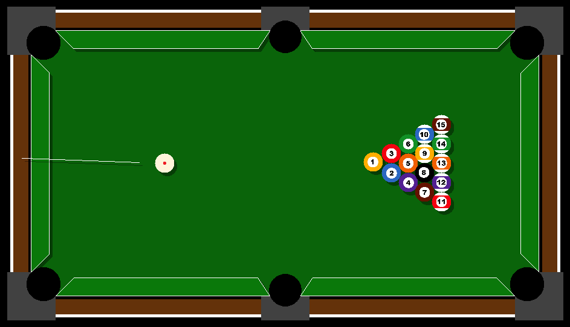

# Simulacija bilijara

## Kako koristiti program
**Kada su kugle zaustavljene:**
 1. Pomeranjem misa namestate stap
 2. Tockicem misa birate jacinu udarca
 3. Desni klik fiksira stap
 4. Levi klik udara belu kuglu

**U koliko se kugla ubaci u rupu vracanje na sto se vrsi pomocu misa. Kada postavite misa na zeljeno mesto pritisnite desni klik.**

**Precice na tastaturi:**

 * `Q` ili `ESC` izlazi iz programa
 * `P` pauzira igru
 * `R` rotira kugle ka igracu
 * `S` zaustavlja kugle u trenutku
 * `A` vraca kugle u pocetnu poziciju
 * `T` ukljucuje/iskljucuje jednostavno crtanje
 * `O` ukljucuje/iskljucuje osetljivost stapa za precizno bitanje jacine udarca

**Seme boja:**
 * `Z` zelena
 * `B` plava

## Linux

Program koristi graficku biblioteku SFML v2.5+. Za Arch linux mozete je preuzeti komandom:
```
pacman -S sfml
```
Da bi ste kompajlovali program:
```
cd bilijar/
make run
```

## Windows

```
g++ -std=c++14 -O2 -o bilijar.exe bilijar\*.cpp -I sfml\include -L sfml\lib -lsfml-graphics -lsfml-window -lsfml-system
```
