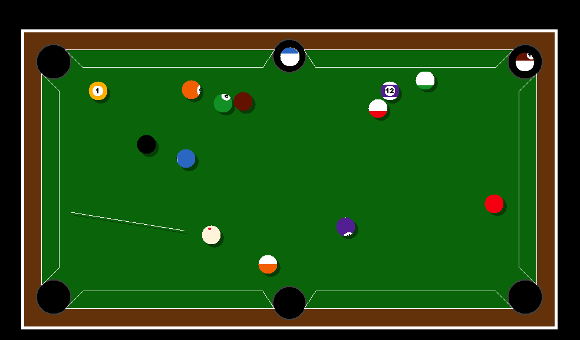

# Simulacija interagovanja kugli

## Linux

```
pacman -S sfml
cd bilijar/
make run
```

## Windows

```
g++ -std=c++14 -O2 -o bilijar.exe bilijar\*.cpp -I sfml\include -L sfml\lib -lsfml-graphics -lsfml-window -lsfml-system
```
