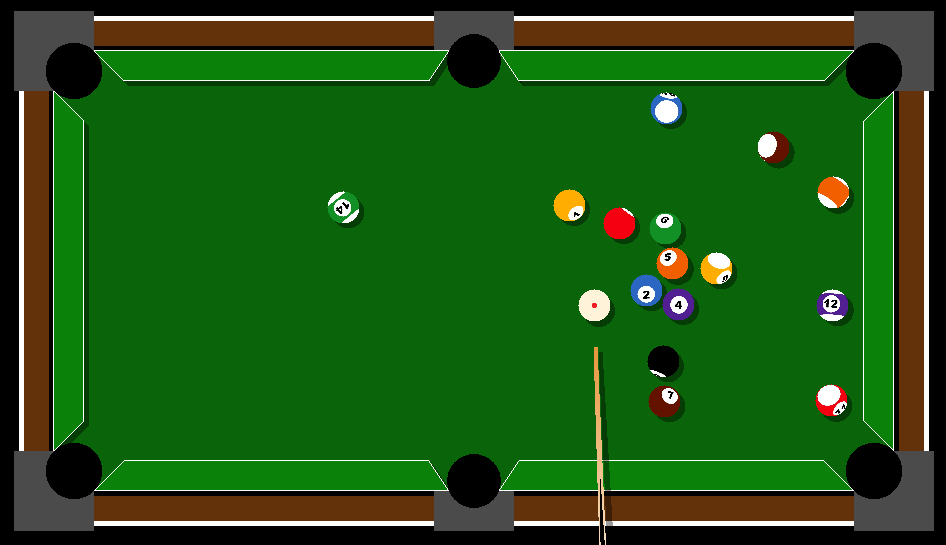

# Simulacija bilijara

## Kako koristiti program
**Kada su kugle zaustavljene:**
 1. Pomeranjem miša nameštate štap
 2. Točkićem miša birate jačinu udarca
 3. Desni klik fiksira štap
 4. Levi klik udara belu kuglu

**U koliko se bela kugla ubaci u rupu vraćanje na sto se vrši pomoću miša. Kada postavite miš na željeno mesto pritisnite desni klik.**

**Prečice na tastaturi:**

 * `Q` ili `ESC` izlazi iz programa
 * `P` pauzira igru
 * `U` vraća poziciju pre poslednjeg udarca
 * `L` uključuje/isključuje pomoćne linije
 * `R` rotira kugle ka igraču
 * `S` zaustavlja kugle koje su u pokretu
 * `A` vraća kugle u početnu poziciju
 * `N` ciljanje naopacke (namešta putanju/namesta štap)
 * `T` uključuje/isključuje jednostavno crtanje
 * `O` uključuje/isključuje osetljivost štapa za precizno biranje jačine udarca

**Šeme boja:**
 * `G` zelena
 * `B` plava

## Kako preuzeti program

Preporučeno je manuelno kompajlovati program na GNU/Linux-u, ali ne i na Windowsu.

Zbog toga, postoje vec kompajlovane verzije koje se mogu naci na sledecoj [stranici](https://github.com/vmisovic/bilijar/releases).

## Kompajlovanje

### Linux

##### SFML
Program koristi grafičku biblioteku SFML v2.5.1+.
Za distribucije bazirane na Arch Linux-u možete je preuzeti komandom:
```
sudo pacman -S sfml
```
dok je za distribucije bazirane na Debianu možete preuzeti komandom
```
sudo apt install libsfml-dev
```
##### Kompajlovanje i pokretanje

Da bi ste kompajlovali program:
```
cd src
make run
```

### Windows
_Komajlujete na w*nd0wsu na sopstvenu odgovornost_

##### SFML
Na Windowsu možete skinuti SFML biblioteku na sledećem linuku [v2.5.1](https://www.sfml-dev.org/files/SFML-2.5.1-windows-gcc-7.3.0-mingw-64-bit.zip).

##### Kompajlovanje
```
cd src
g++ -std=c++14 -O2 -o bilijar.exe *.cpp -I sfml\include -L sfml\lib -lsfml-graphics -lsfml-window -lsfml-system
```
